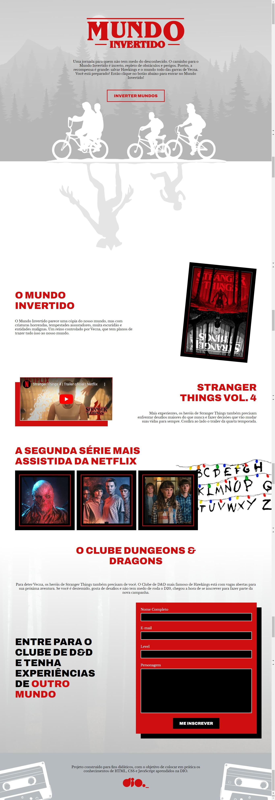

# Landing Page Stranger Things
Projeto criado através da plataforma Digital Innovation One (DIO).
## Deploy da aplicação

https://landpg-strthgs.netlify.app/

## Tecnologias utilizadas

+ HTML5
+ CSS3
+ JavaScript
+ Firebase

## Estrutura do site

+ Página Inicial: Local onde é possível ver uma sinopse sobre a série Stranger Things e onde se encontra o botão para inverter os mundos(mudar de light theme para dark theme).
+ Formulário: Seção onde é possível se inscrever no clube Dungeons & Dragons.

## Light Theme

## Dark Theme

